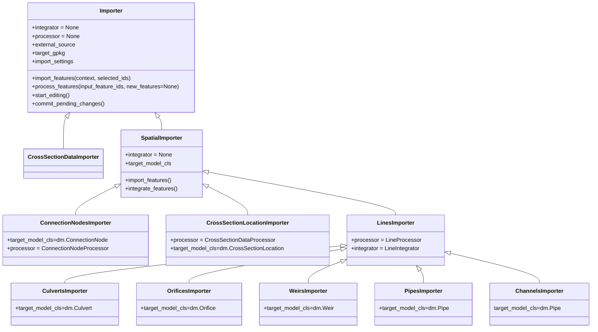
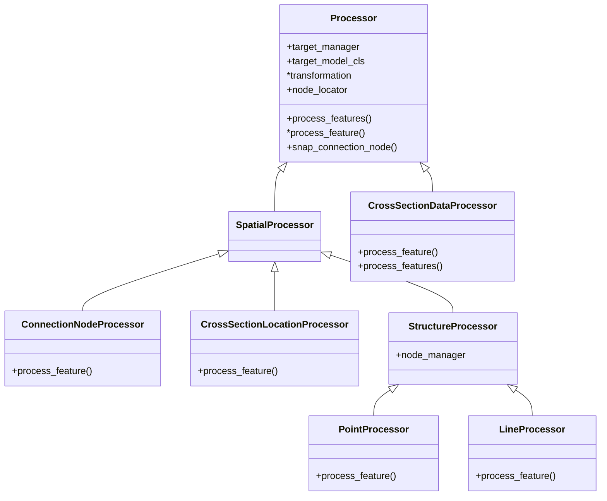

# Note on Design

## Vector data importer

Vector data import is handled via an Importer class which takes care of importing via `import_features`. This method takes care of processing the features from source using a `Processor` clas. If requested, features are integrated onto an existing structure using an Integrator class. `Processor` covers the most generic functionality and `SpatialProcessor` add functionality to process imports for spatial data onto a single layer. `LineProcesser` specifies the functionality of `SpatialProcessor` further for imports of line objects. For each specific importer a derived class is created, based on any of these three parents, which stores the settings specific to that importer.

Processing is split into processing for connection nodes, cross section locations, points and lines, and cross section data. The base classes `Processor` acts as an interface and collects shared logic. Shared logic for processing spatial data for single targets is collected in the `SpatialProcesser` and further shared functionality for lines and points is collected in the `StructureProcessor`. `Processor` also manage the indices of added target objects and nodes via the `target_manager` and `node_manager` which are instances of a `FeatureManager`.  

When objects are integrated on existing structures an `Integrator` is used as well. This class takes care of finding the overlapping structure, makes the needed modifications and adds connection nodes if needed. Like the Processor, the `Integrator` uses a `FeatureManager` to handle the new objects' indices. At the moment there is only a `LinearIntegrator` that integrates new objects on channels or pipes.
