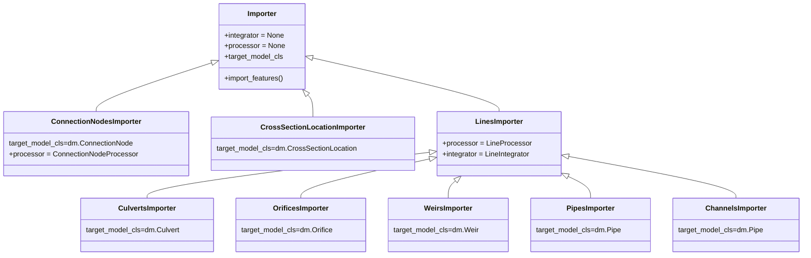
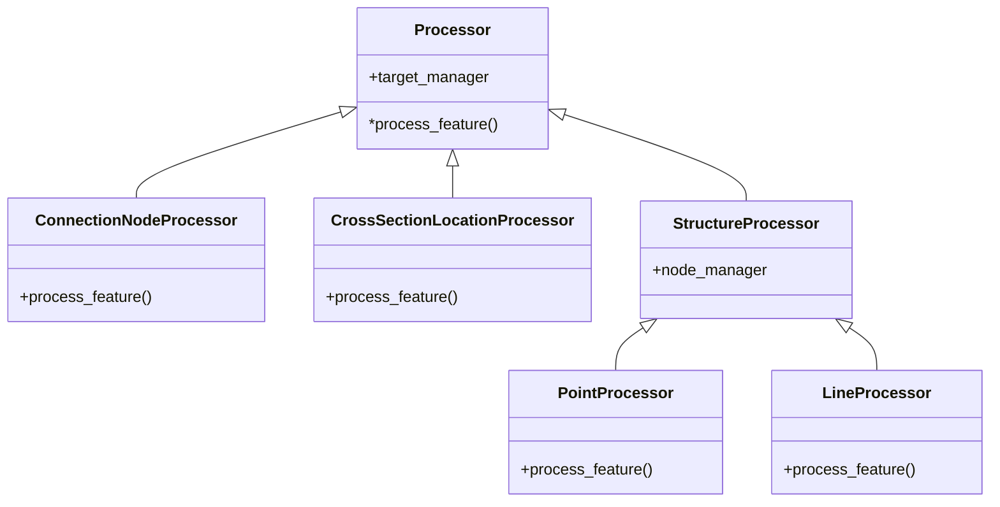

# Note on Design

## Vector data importer

Vector data import is handled via an Import class which takes care of importing via `import_features`. This method takes care of processing the features from source using a Processor clas. If requested, features are integrated onto an existing structure using an Integrator class. While all the logic is implemented in `Processor.import_features` several derived classes are added with presets for the integrator, processor and the target model class

Processing is split into processing for connection nodes, cross section locations, and points and lines. The base classes Processor acts as an interface and collects shared logic. Shared logic for processing lines and points in collected in StructureProcessor. Processor also manage the indices of added target objects and nodes via the `target_manager` and `node_manager` which are instances of a `FeatureManager`.  

When objects are integrated on existing structures an Integrator is used as well. This class takes care of finding the overlapping structure, makes the needed modifications and adds connection nodes if needed. Like the Processor, the Integrator uses a `FeatureManager` to handle the new objects' indices. At the moment there is only a `LinearIntegrator` that integrates new objects on channels or pipes.
