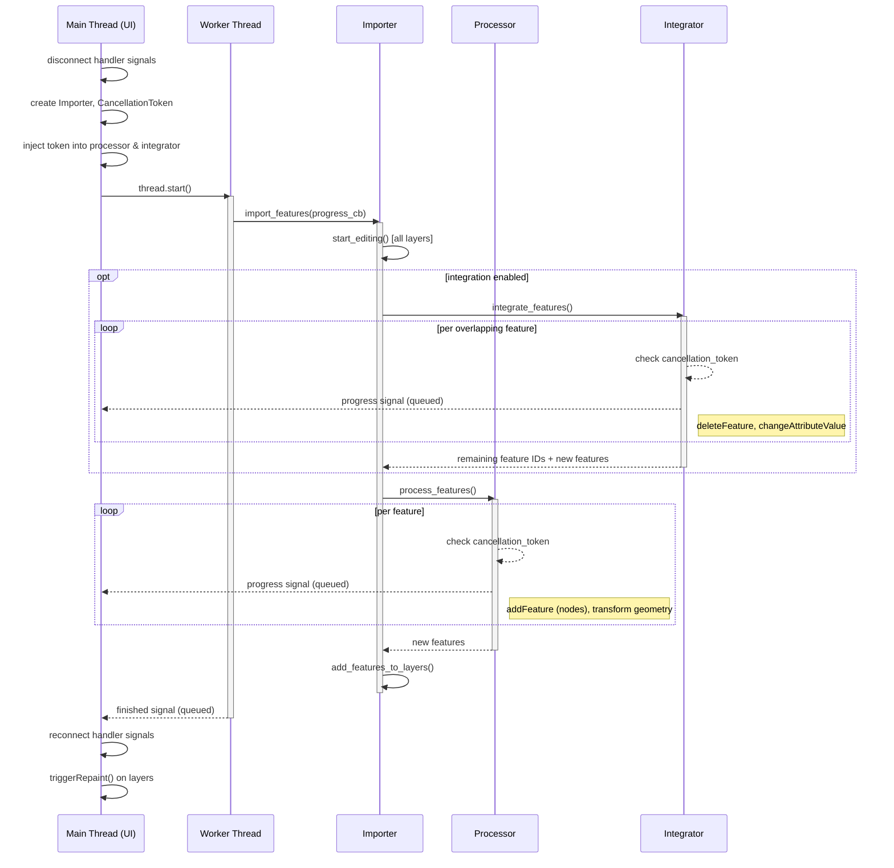
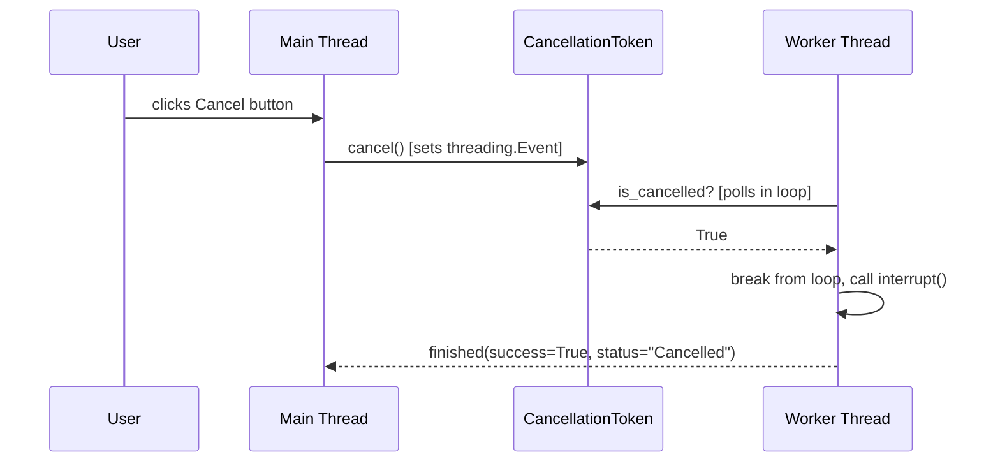
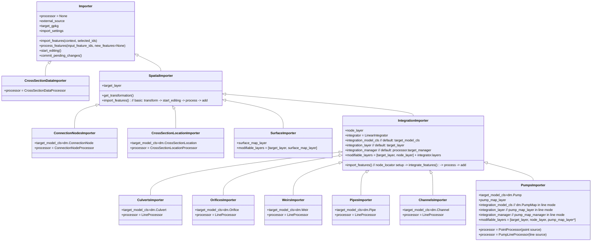
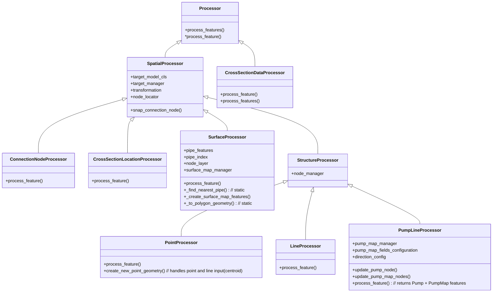
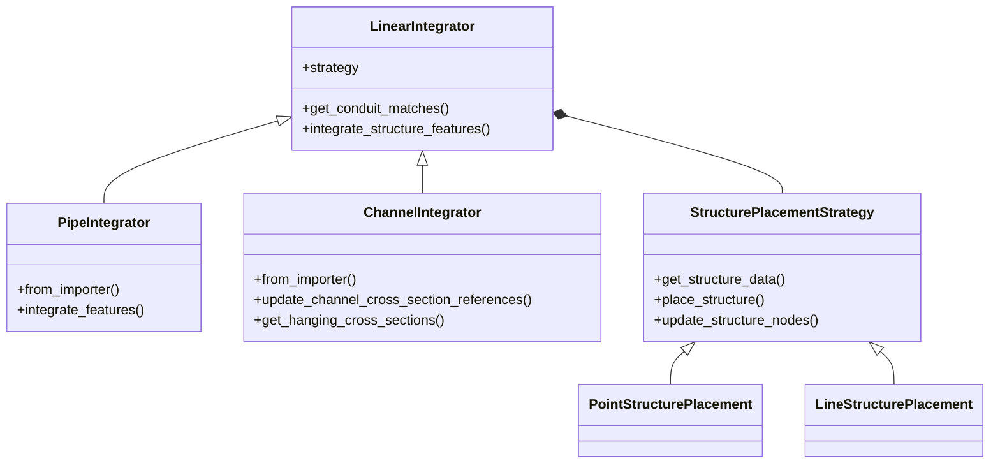

# Vector data importer

## Overall flow

The vector data importer takes features from a source layer and writes them into a schematisation GeoPackage. The high-level steps are:

1. The wizard (or a QGIS Processing algorithm) collects import settings and creates an `Importer`.
2. `import_features()` is called (on a worker thread from the wizard, or synchronously from Processing).
3. All target layers are put into editing mode (`start_editing()`).
4. If integration is enabled, the **Integrator** runs first — it handles features that overlap existing structures (e.g. splitting a channel to insert a weir).
5. The **Processor** then handles the remaining features — transforming geometries, snapping/creating connection nodes, and building target features.
6. All new features are added to their respective layers (`add_features_to_layers()`).
7. Layers remain in editing mode for user review (the wizard does not commit automatically; the Processing algorithm does).

The `IntegrationMode` enum (`NONE`, `CHANNELS`, `PIPES`) in `settings_models.py` determines whether an integrator is used and which type.

## Threading model

When invoked from the wizard, the import runs on a separate `QThread` to keep the UI responsive. The Processing algorithm version runs synchronously on the main thread.

### Sequence diagram

### Cancellation

`CancellationToken` wraps a `threading.Event` (thread-safe). The main thread sets it; the processor/integrator poll it in their per-feature loops.

### Key design decisions

- **Handler signals are disconnected** before the import starts and reconnected after. This prevents signal-driven side effects (validation, multi-editing) during the import.
- **No `commitChanges()` from the wizard** — layers stay in editing mode so the user can review and roll back. The Processing algorithm version *does* commit.
- **No repaint until after the thread finishes** — `triggerRepaint()` is called on the main thread in `handle_finished`.
- **Layer edits happen on the worker thread.** This includes `addFeature`, `deleteFeature`, `changeAttributeValue`, etc. This is not officially safe per QGIS documentation, but works in practice because handler signals are disconnected and no rendering occurs during the import.

### Progress reporting

The importer calls a `progress_callback(value=, add=, maximum=)` function. `ImportWorker` wraps this into a `pyqtSignal(dict)` which crosses the thread boundary via Qt's queued connection mechanism, updating the progress bar on the main thread.

### Thread safety notes

All QGIS layer operations (`startEditing`, `addFeatures`, `deleteFeature`, etc.) run on the worker thread. This is technically unsafe per QGIS docs. It works because:
- Handler signals are disconnected (no reentrant edits).
- Changes stay in the edit buffer (no disk writes).
- No rendering happens until after the thread finishes.

If you need to add new layer operations during the import, keep them inside the existing `import_features()` call tree — do not introduce additional thread crossings or main-thread layer access during the import.

## Importers

The `Importer` class hierarchy handles the import orchestration. Each concrete importer knows its target model class and which processor/integrator to use.

`SpatialImporter` holds the `target_layer`, provides `get_transformation()` and a basic `import_features()` implementation (transform → start editing → process → add). Node-related resources and integration orchestration are scoped to `IntegrationImporter` because integration requires both a node layer and an integrator. Concrete importers extend `IntegrationImporter` and assign their own processor. `SurfaceImporter` is a direct child of `SpatialImporter` that additionally manages a `surface_map_layer`.

- `SpatialImporter.import_features()` performs coordinate transformation, calls the processor, and adds resulting features. It puts only the `target_layer` into edit mode by default.
- `IntegrationImporter.import_features()` additionally prepares the `node_locator`, initialises an `integrator` (`LinearIntegrator`), and puts the `node_layer` and any integrator-managed layers into edit mode. Each concrete subclass assigns its own processor after calling `super().__init__()`.
- `IntegrationImporter` exposes three integration-target properties — `integration_model_cls`, `integration_layer`, and `integration_manager` — which default to the target equivalents (`target_model_cls`, `target_layer`, `processor.target_manager`). Subclasses can override these to redirect the integrator to a different layer than the primary import target. `PumpsImporter` does this in line mode to point the integrator at `pump_map_layer` instead of `target_layer`.
- `SurfaceImporter` produces both a target surface layer and an auxiliary `surface_map_layer`. Both are put into edit mode. The pipe layer and node layer are passed to `SurfaceProcessor` at construction time for spatial linking.

## Processors

Processing is split into processing for connection nodes, cross section locations, points and lines, cross section data, and surfaces. The base class `Processor` acts as an interface and collects shared logic. `SpatialProcessor` adds functionality for spatial data (coordinate transformation, node snapping) and manages indices of added target objects via a `target_manager` (`FeatureManager`). `StructureProcessor` adds a `node_manager` for connection node index tracking and further shared functionality for lines and points. `SurfaceProcessor` handles polygon surfaces: it converts curved geometries to plain polygons, computes area, applies field mapping, and creates `surface_map` entries by spatially linking each surface to the nearest pipe of the configured sewerage type.

## Connection node matching

When importing point or linear structures the processors attempt to match each feature endpoint to an existing connection node according to the active connection node settings. Behaviour (applies to `PointProcessor`, `LineProcessor`, and `PumpLineProcessor`):

1. After transforming the geometry, `update_connection_nodes()` is called for each endpoint.
2. For each endpoint, `get_node(point)` is used which consults a `QgsPointLocator` built from the schematisation's existing connection node layer (`node_locator`).
3. The locator attempts to snap to the nearest existing connection node within `snap_distance` (from `ConnectionNodeSettings`.snap_distance). If `ConnectionNodeSettings.snap` is `False` the effective snap distance is effectively 0 (1e-9 m), so only exactly overlapping nodes will snap.
4. If a node is found within snap distance: the imported feature's `connection_node_id` is set to that node's id and the feature endpoint geometry is snapped to the node's exact position.
5. If no node is found and `ConnectionNodeSettings.create_nodes` is `True`: a new connection node is created at that point and added to the node layer immediately so subsequent endpoints can also snap to it.
6. If no node is found and `create_nodes` is False: no connection node is assigned (the `connection_node_id` remains `NULL`).

Notes:
- For `LineProcessor` both start and end points are processed via `update_connection_nodes` and the line geometry endpoints may be moved to snap to existing nodes.
- New nodes are added immediately to the node layer during processing so they are available for later features in the same import pass.

## Surface-to-pipe linking

`SurfaceProcessor` creates `surface_map` entries by linking imported surface polygons to connection nodes, using attribute matching, spatial matching, or both. The main entry point is `create_surface_map_features()`, which is called once per imported surface feature and produces zero or more `surface_map` features.

### Data formats

`SurfaceLinkingSettings.data_format` determines how the set of `(percentage, sewerage_type)` pairs is derived from each source feature:

- **`wide`** (default): the source layer has one row per surface. `sewerage_type_mappings` lists one entry per sewerage type, each naming a `percentage_column` in the source feature. For each mapping where `percentage_column` is set and `pct > 0`, one `surface_map` entry is attempted. This format supports multiple `surface_map` entries per source feature (one per sewerage type).

- **`long`**: the source layer has one row per `(surface, sewerage_type)` pair. The percentage is read via the `percentage` field-map config and the sewerage type via `sewerage_type_config`. Exactly 0 or 1 `surface_map` entries are produced per source feature.

In both formats, each `(pct, sewerage_type)` pair is then resolved to a connection node via the node resolution strategy below.

### Node resolution: attribute match then spatial match

For each `(pct, sewerage_type)` pair, `create_surface_map_feature()` attempts to resolve a connection node in order:

1. **Attribute match** (`get_attribute_match`, tried first when `attribute_match_enabled` is `True` and `attribute_match_table` is set):
   - Read the lookup value from the source feature using `attribute_match_input_config`.
   - Search `attribute_match_table` (`pipe` or `connection_node`) for features where `attribute_match_col` equals that value.
   - If matching against a pipe and `sewerage_type` is not `None`, reject any pipe whose `sewerage_type` does not match.
   - Exactly one match → use it. For a pipe match, resolve to its nearer endpoint node via `get_closest_node`. Zero or multiple matches → fall through to spatial.

2. **Spatial match** (`get_spatial_match`, fallback when `spatial_match_enabled` is `True`):
   - Buffer the surface geometry by `search_distance` and query the pre-built pipe spatial index.
   - Filter candidates by `sewerage_type` when not `None`; match any pipe when `None`.
   - Skip pipes whose start or end node has `visualisation == 1` (outlet nodes).
   - Discard candidates whose distance to the surface exceeds `search_distance`.
   - Pick the nearest pipe → resolve to its nearer endpoint node via `get_closest_node`.

3. If both methods return no match → emit `ProcessorWarning` and skip this mapping entry.

Once a node is resolved, a `surface_map` feature is created with:
- `surface_id` = the new surface's id
- `connection_node_id` = the resolved node's id
- `percentage` = the percentage value
- `geometry` = LINESTRING from `surface.pointOnSurface()` to the node point

Other surface map properties are either use their own field map (long data) or use the same values as used for the surface itself (wide data).

## Integrators

When objects are integrated onto existing structures, an `Integrator` handles finding the overlapping structure, splitting it, and adding connection nodes as needed. `LinearIntegrator` is the base class with two concrete subclasses:

- `PipeIntegrator` — integrates new objects onto existing pipes.
- `ChannelIntegrator` — integrates new objects onto existing channels, with additional logic for managing cross-section locations (updating references, copying cross-sections to new channel segments, removing orphaned ones).

The integrator to use is determined by `IntegrationMode` and created via the factory method `LinearIntegrator.get_integrator()`.

### Structure placement strategies

`LinearIntegrator` delegates structure-type-specific behaviour to a `StructurePlacementStrategy` instance, injected at construction time by `PipeIntegrator.from_importer` and `ChannelIntegrator.from_importer`. The strategy is selected based on `importer.integration_model_cls.__geometrytype__` (which defaults to `target_model_cls.__geometrytype__` for all importers except `PumpsImporter` in line mode, where it resolves to `dm.PumpMap`):

- **`LineStructurePlacement`** — for line-geometry structures (Weir, Orifice, Culvert). Computes position and length via `lineLocatePoint`, places a `curveSubstring` on the conduit, and assigns `connection_node_id_start`/`connection_node_id_end`.
- **`PointStructurePlacement`** — for point-geometry structures (Pump). Computes position via `lineLocatePoint` with `length=0`, places a point via `conduit_geom.interpolate(m)`, and assigns a single `connection_node_id`.

Connection node assignment for cut conduit segments (always line geometry, always `connection_node_id_start`/`_end`) is handled by `LinearIntegrator._update_conduit_endpoints` independently of the strategy.

### Matching: `get_conduit_matches`

Before integration, `LinearIntegrator.get_conduit_matches()` performs a single pass over all conduits to determine which structures snap to which conduit. It returns a list of `(conduit, [structures])` pairs containing only unambiguous matches.

Matching uses a two-step spatial filter:

1. **Coarse filter:** the conduit's bounding box, expanded by `snapping_distance`, is used to query the spatial index for candidate structures.
2. **Precise check:** a buffer of `snapping_distance` is constructed around the structure's point (or endpoints for line structures) and tested for intersection with the conduit geometry.

Structures that pass the precise check for more than one conduit are considered ambiguous. They are excluded from integration, reported together in a single `StructuresIntegratorWarning`, and marked as processed so they do not fall through to the processor.

## Warnings

The import uses a structured warning system (defined in `warnings.py`): `StructuresIntegratorWarning`, `FeaturesImporterWarning`, `ProcessorWarning`, and `GeometryImporterWarning`. These are captured by the `CatchThreediWarnings` context manager during import execution and displayed to the user in the wizard's log panel.

## QGIS Processing integration

The same importer classes can be invoked headlessly via QGIS Processing algorithms (in `processing/algorithms_vector_data_importer.py`). These read import settings from a JSON config file and call `import_features()` followed by `commit_pending_changes()` — running synchronously on the main thread.

## Import configuration models and validation

The import settings are collected in `ImportSettings` (a pydantic model) which holds several submodels for connection node settings, integration settings, cross-section data remapping, point-to-line conversion, and field mappings.

Surface-specific settings are captured in `SurfaceLinkingSettings`, nested inside `ImportSettings`. There is no separate `SurfaceSettings` model. `SurfaceLinkingSettings` controls how imported surface polygons are spatially and/or attribute-linked to existing schematisation pipes/nodes.

`SurfaceLinkingSettings` contains the following fields:

- `data_format: Literal["long", "wide"]` — whether the source data is in "long" format (one row per sewerage type mapping) or "wide" format (one row per surface with multiple percentage columns).
- `sewerage_type_config: Optional[FieldMapConfig]` — (long format only) field-map config for reading the sewerage type value from each source feature.
- `sewerage_type_mappings: list[SewerTypeMapping]` — (wide format only) list of per-sewerage-type configurations; each `SewerTypeMapping` has a `sewerage_type: int` and an optional `percentage_column: str`.
- `search_distance: float` — buffer around the surface geometry used to search for candidate pipes during spatial linking. Default 40 m.
- `selected_pipes_only: bool` — when `True`, only pipes selected in the provided pipe layer are considered as candidates for linking. Defaults to `False`.
- `spatial_match_enabled: bool` — when `True`, spatial linking (nearest-pipe search) is performed. Defaults to `True`.
- `attribute_match_enabled: bool` — when `True`, attribute-based linking is attempted before spatial. Defaults to `False`.
- `attribute_match_table: Optional[Literal["pipe", "connection_node"]]` — which table to look up for attribute matching (`pipe` or `connection_node`).
- `attribute_match_col: Optional[str]` — the column in `attribute_match_table` to compare against.
- `attribute_match_input_config: Optional[FieldMapConfig]` — field-map config for reading the lookup value from the source feature.

The `FieldMapConfig` is a model designed to validate configuration that maps values from a source layer to a target layer. It has custom validations:
* required fields based on the value of `method`;
* allowed methods based on the `allowed_methods` in the field metadata.

A `FieldMapConfig` is typically related to an attribute of a data model (from `data_models.py`) and the method `get_field_map_config_for_model_class_field` will create a `FieldMapConfig` for a specific field from a data model. In this way the allowed methods and data type for the default value are derived from the data model. The allowed methods can be specified for an attribute, if not the following rules are used:
* any field with the name "id" has only AUTO as an allowed method;
* any other field has all methods from `ColumnImportMethod` as allowed method, except for AUTO;
* if the type of field is not optional, `ColumnImportMethod` IGNORE is removed from the allowed methods.

### Other settings models

**`PointToLineSettings`** is used when importing point features that need to be converted to line features (e.g. orifices or weirs given as points). It contains:

- `length: FieldMapConfig` — how to derive the line length from the source feature (ATTRIBUTE, DEFAULT, or EXPRESSION).
- `azimuth: FieldMapConfig` — how to derive the bearing/azimuth of the generated line (default value: 90°).

**`PumpSettings`** controls pump-specific import options:

- `direction: FieldMapConfig[int]` — determines the direction of the source line when importing HyDaMo pump_map lines. Default value `1` (positive, line used as-is). Value `-1` reverses the line before processing (swapping pump and connection node ends). Allowed methods: ATTRIBUTE, EXPRESSION, DEFAULT.

**`CrossSectionLocationSettings`** controls how cross-section location features are joined to conduits:

- `join_field_src: FieldMapConfig` — source field used for joining.
- `join_field_tgt: FieldMapConfig` — target field on the conduit used for joining.
- `snap_distance: float` — snap threshold for attaching cross-section locations to their conduit geometry.
