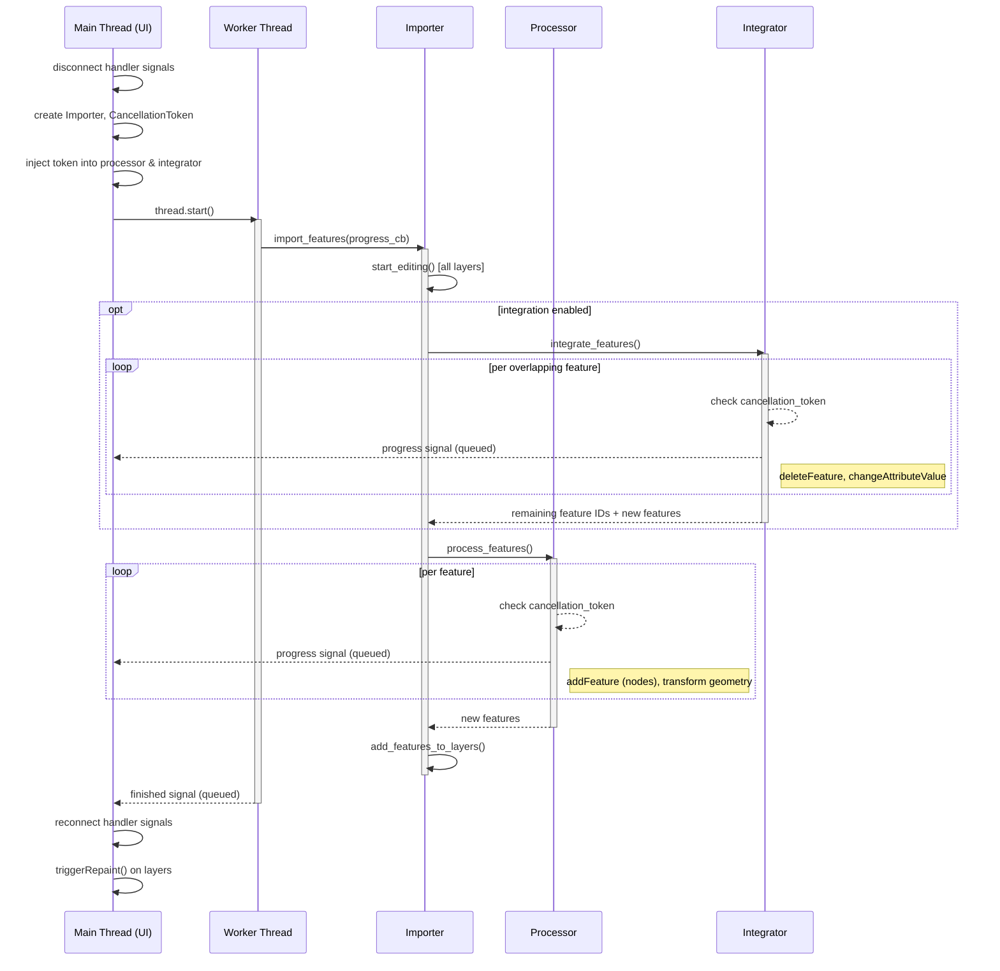
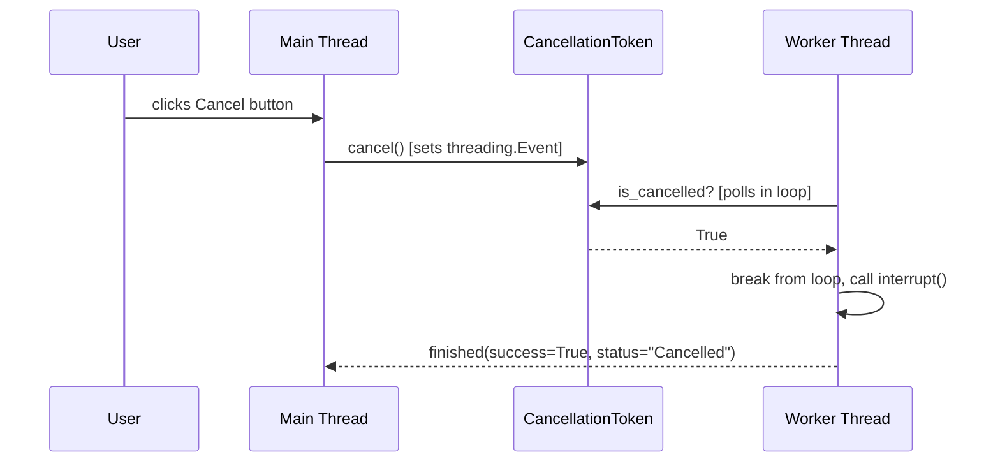
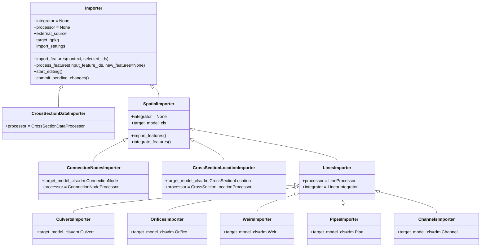
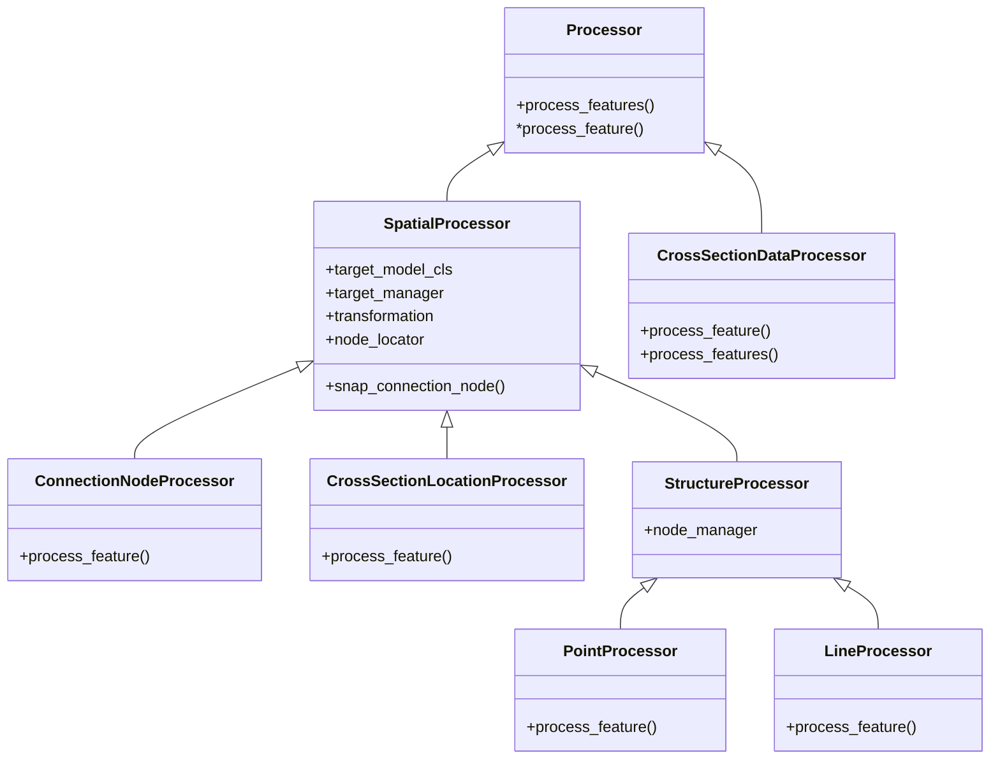

# Vector data importer

## Overall flow

The vector data importer takes features from a source layer and writes them into a schematisation GeoPackage. The high-level steps are:

1. The wizard (or a QGIS Processing algorithm) collects import settings and creates an `Importer`.
2. `import_features()` is called (on a worker thread from the wizard, or synchronously from Processing).
3. All target layers are put into editing mode (`start_editing()`).
4. If integration is enabled, the **Integrator** runs first — it handles features that overlap existing structures (e.g. splitting a channel to insert a weir).
5. The **Processor** then handles the remaining features — transforming geometries, snapping/creating connection nodes, and building target features.
6. All new features are added to their respective layers (`add_features_to_layers()`).
7. Layers remain in editing mode for user review (the wizard does not commit automatically; the Processing algorithm does).

The `IntegrationMode` enum (`NONE`, `CHANNELS`, `PIPES`) in `settings_models.py` determines whether an integrator is used and which type.

## Threading model

When invoked from the wizard, the import runs on a separate `QThread` to keep the UI responsive. The Processing algorithm version runs synchronously on the main thread.

### Sequence diagram

### Cancellation

`CancellationToken` wraps a `threading.Event` (thread-safe). The main thread sets it; the processor/integrator poll it in their per-feature loops.

### Key design decisions

- **Handler signals are disconnected** before the import starts and reconnected after. This prevents signal-driven side effects (validation, multi-editing) during the import.
- **No `commitChanges()` from the wizard** — layers stay in editing mode so the user can review and roll back. The Processing algorithm version *does* commit.
- **No repaint until after the thread finishes** — `triggerRepaint()` is called on the main thread in `handle_finished`.
- **Layer edits happen on the worker thread.** This includes `addFeature`, `deleteFeature`, `changeAttributeValue`, etc. This is not officially safe per QGIS documentation, but works in practice because handler signals are disconnected and no rendering occurs during the import.

### Progress reporting

The importer calls a `progress_callback(value=, add=, maximum=)` function. `ImportWorker` wraps this into a `pyqtSignal(dict)` which crosses the thread boundary via Qt's queued connection mechanism, updating the progress bar on the main thread.

### Thread safety notes

All QGIS layer operations (`startEditing`, `addFeatures`, `deleteFeature`, etc.) run on the worker thread. This is technically unsafe per QGIS docs. It works because:
- Handler signals are disconnected (no reentrant edits).
- Changes stay in the edit buffer (no disk writes).
- No rendering happens until after the thread finishes.

If you need to add new layer operations during the import, keep them inside the existing `import_features()` call tree — do not introduce additional thread crossings or main-thread layer access during the import.

## Importers

The `Importer` class hierarchy handles the import orchestration. Each concrete importer knows its target model class and which processor/integrator to use.

## Processors

Processing is split into processing for connection nodes, cross section locations, points and lines, and cross section data. The base class `Processor` acts as an interface and collects shared logic. `SpatialProcessor` adds functionality for spatial data (coordinate transformation, node snapping) and manages indices of added target objects via a `target_manager` (`FeatureManager`). `StructureProcessor` adds a `node_manager` for connection node index tracking and further shared functionality for lines and points.

## Integrators

When objects are integrated onto existing structures, an `Integrator` handles finding the overlapping structure, splitting it, and adding connection nodes as needed. `LinearIntegrator` is the base class with two concrete subclasses:

- `PipeIntegrator` — integrates new objects onto existing pipes.
- `ChannelIntegrator` — integrates new objects onto existing channels, with additional logic for managing cross-section locations (updating references, copying cross-sections to new channel segments, removing orphaned ones).

The integrator to use is determined by `IntegrationMode` and created via the factory method `LinearIntegrator.get_integrator()`.

## Warnings

The import uses a structured warning system (defined in `warnings.py`): `StructuresIntegratorWarning`, `FeaturesImporterWarning`, `ProcessorWarning`, and `GeometryImporterWarning`. These are captured by the `CatchThreediWarnings` context manager during import execution and displayed to the user in the wizard's log panel.

## QGIS Processing integration

The same importer classes can be invoked headlessly via QGIS Processing algorithms (in `processing/algorithms_vector_data_importer.py`). These read import settings from a JSON config file and call `import_features()` followed by `commit_pending_changes()` — running synchronously on the main thread.

## Import configuration models and validation

The import settings are collected in `ImportSettings` (a pydantic model) which holds several submodels for connection node settings, integration settings, cross-section data remapping, point-to-line conversion, and field mappings.

The `FieldMapConfig` is a model designed to validate configuration that maps values from a source layer to a target layer. It has custom validations:
* required fields based on the value of `method`;
* allowed methods based on the `allowed_methods` in the field metadata.

A `FieldMapConfig` is typically related to an attribute of a data model (from `data_models.py`) and the method `get_field_map_config_for_model_class_field` will create a `FieldMapConfig` for a specific field from a data model. In this way the allowed methods and data type for the default value are derived from the data model. The allowed methods can be specified for an attribute, if not the following rules are used:
* any field with the name "id" has only AUTO as an allowed method;
* any other field has all methods from `ColumnImportMethod` as allowed method, except for AUTO;
* if the type of field is not optional, `ColumnImportMethod` IGNORE is removed from the allowed methods.
