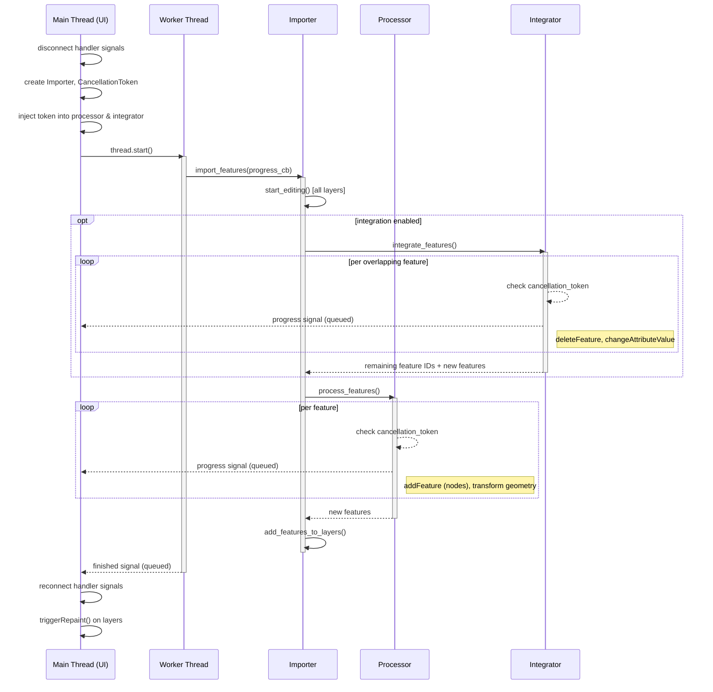
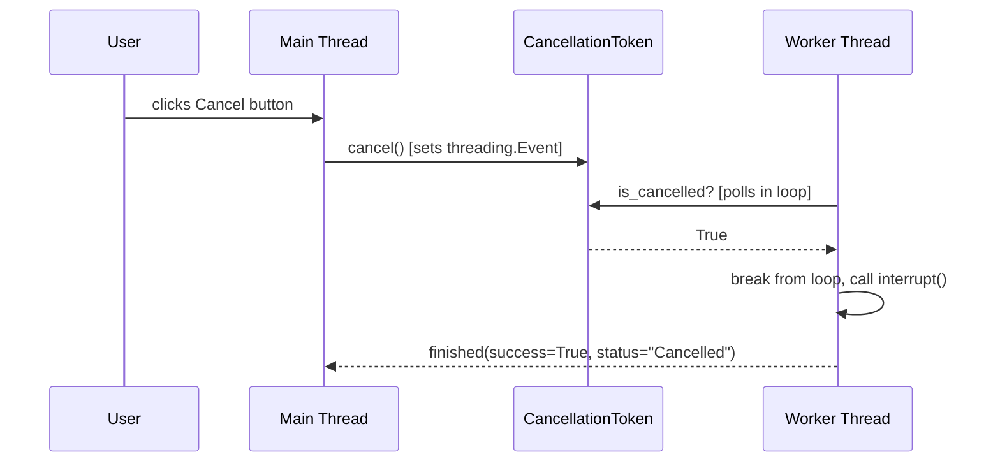
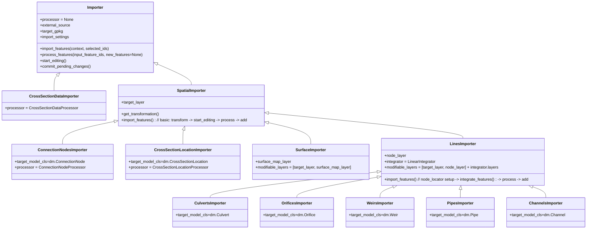
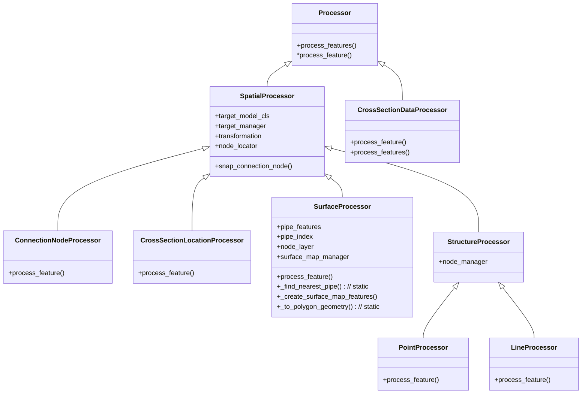
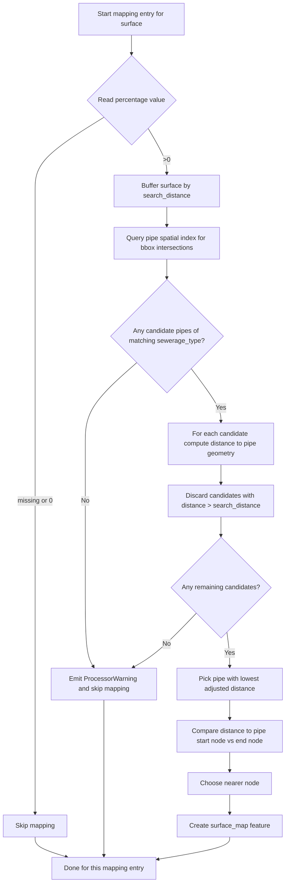

# Vector data importer

## Overall flow

The vector data importer takes features from a source layer and writes them into a schematisation GeoPackage. The high-level steps are:

1. The wizard (or a QGIS Processing algorithm) collects import settings and creates an `Importer`.
2. `import_features()` is called (on a worker thread from the wizard, or synchronously from Processing).
3. All target layers are put into editing mode (`start_editing()`).
4. If integration is enabled, the **Integrator** runs first — it handles features that overlap existing structures (e.g. splitting a channel to insert a weir).
5. The **Processor** then handles the remaining features — transforming geometries, snapping/creating connection nodes, and building target features.
6. All new features are added to their respective layers (`add_features_to_layers()`).
7. Layers remain in editing mode for user review (the wizard does not commit automatically; the Processing algorithm does).

The `IntegrationMode` enum (`NONE`, `CHANNELS`, `PIPES`) in `settings_models.py` determines whether an integrator is used and which type.

## Threading model

When invoked from the wizard, the import runs on a separate `QThread` to keep the UI responsive. The Processing algorithm version runs synchronously on the main thread.

### Sequence diagram

### Cancellation

`CancellationToken` wraps a `threading.Event` (thread-safe). The main thread sets it; the processor/integrator poll it in their per-feature loops.

### Key design decisions

- **Handler signals are disconnected** before the import starts and reconnected after. This prevents signal-driven side effects (validation, multi-editing) during the import.
- **No `commitChanges()` from the wizard** — layers stay in editing mode so the user can review and roll back. The Processing algorithm version *does* commit.
- **No repaint until after the thread finishes** — `triggerRepaint()` is called on the main thread in `handle_finished`.
- **Layer edits happen on the worker thread.** This includes `addFeature`, `deleteFeature`, `changeAttributeValue`, etc. This is not officially safe per QGIS documentation, but works in practice because handler signals are disconnected and no rendering occurs during the import.

### Progress reporting

The importer calls a `progress_callback(value=, add=, maximum=)` function. `ImportWorker` wraps this into a `pyqtSignal(dict)` which crosses the thread boundary via Qt's queued connection mechanism, updating the progress bar on the main thread.

### Thread safety notes

All QGIS layer operations (`startEditing`, `addFeatures`, `deleteFeature`, etc.) run on the worker thread. This is technically unsafe per QGIS docs. It works because:
- Handler signals are disconnected (no reentrant edits).
- Changes stay in the edit buffer (no disk writes).
- No rendering happens until after the thread finishes.

If you need to add new layer operations during the import, keep them inside the existing `import_features()` call tree — do not introduce additional thread crossings or main-thread layer access during the import.

## Importers

The `Importer` class hierarchy handles the import orchestration. Each concrete importer knows its target model class and which processor/integrator to use.

`SpatialImporter` holds the `target_layer`, provides `get_transformation()` and a basic `import_features()` implementation (transform → start editing → process → add). Node-related resources and integration orchestration are scoped to `LinesImporter` because integration is only relevant for linear structures. `SurfaceImporter` is a direct child of `SpatialImporter` that additionally manages a `surface_map_layer`.

- `SpatialImporter.import_features()` performs coordinate transformation, calls the processor, and adds resulting features. It puts only the `target_layer` into edit mode by default.
- `LinesImporter.import_features()` additionally prepares the `node_locator`, initialises an `integrator` (`LinearIntegrator`), and puts the `node_layer` and any integrator-managed layers into edit mode.
- `SurfaceImporter` produces both a target surface layer and an auxiliary `surface_map_layer`. Both are put into edit mode. The pipe layer and node layer are passed to `SurfaceProcessor` at construction time for spatial linking.

## Processors

Processing is split into processing for connection nodes, cross section locations, points and lines, cross section data, and surfaces. The base class `Processor` acts as an interface and collects shared logic. `SpatialProcessor` adds functionality for spatial data (coordinate transformation, node snapping) and manages indices of added target objects via a `target_manager` (`FeatureManager`). `StructureProcessor` adds a `node_manager` for connection node index tracking and further shared functionality for lines and points. `SurfaceProcessor` handles polygon surfaces: it converts curved geometries to plain polygons, computes area, applies field mapping, and creates `surface_map` entries by spatially linking each surface to the nearest pipe of the configured sewerage type.

## Connection node matching

When importing point or linear structures the processors attempt to match each feature endpoint to an existing connection node according to the active connection node settings. Behaviour (applies to `PointProcessor` and `LineProcessor`):

1. After transforming the geometry, `update_connection_nodes()` is called for each endpoint.
2. For each endpoint, `get_node(point)` is used which consults a `QgsPointLocator` built from the schematisation's existing connection node layer (`node_locator`).
3. The locator attempts to snap to the nearest existing connection node within `snap_distance` (from `ConnectionNodeSettings`.snap_distance). If `ConnectionNodeSettings.snap` is `False` the effective snap distance is effectively 0 (1e-9 m), so only exactly overlapping nodes will snap.
4. If a node is found within snap distance: the imported feature's `connection_node_id` is set to that node's id and the feature endpoint geometry is snapped to the node's exact position.
5. If no node is found and `ConnectionNodeSettings.create_nodes` is `True`: a new connection node is created at that point and added to the node layer immediately so subsequent endpoints can also snap to it.
6. If no node is found and `create_nodes` is False: no connection node is assigned (the `connection_node_id` remains `NULL`).

Notes:
- For `LineProcessor` both start and end points are processed via `update_connection_nodes` and the line geometry endpoints may be moved to snap to existing nodes.
- New nodes are added immediately to the node layer during processing so they are available for later features in the same import pass.

## Surface-to-pipe linking

`SurfaceProcessor` creates `surface_map` entries by spatially linking imported surface polygons to the nearest pipe of the configured sewerage type. The algorithm (implemented in _`create_surface_map_features`) runs for each imported surface and for each mapping entry in `SurfaceMapPercentageSettings.sewer_type_mappings`:

1. Read the percentage value from the source feature's configured percentage column. If the value is missing or zero the mapping is skipped.
2. Buffer the surface geometry by `SurfaceLinkingSettings.search_distance` to build a search area.
3. Query a pre-built `QgsSpatialIndex` of pipe features for candidates whose bounding box intersects the buffer. The pipe index is constructed once during `SurfaceProcessor` initialization for performance.
4. Among candidate pipes of the required `sewerage_type`, compute the distance from the surface geometry to each pipe geometry and discard candidates whose distance exceeds `search_distance`.
5. Choose the pipe with the lowest adjusted distance. If no pipe is found within `search_distance` the processor emits a `ProcessorWarning` for this mapping and skips it.
6. For the chosen pipe, compare the surface geometry's distance to the pipe's start node and end node (node features are looked up from the node layer using `get_feature_by_id` / expression queries). Select the nearer node.
7. Create a `surface_map` feature with:
   - `surface_id` = the new surface's id
   - `connection_node_id` = the chosen node's id
   - `percentage` = the percentage value from the source feature
   - `geometry` = LINESTRING from `surface.pointOnSurface()` to the chosen node point

Performance notes:
- The pipe spatial index is built once at `SurfaceProcessor` construction time to avoid repeated index builds.
- Node lookups use expression queries on the node layer (`get_feature_by_id`) and are performed per mapping; this is acceptable for typical import sizes but can be a hotspot for very large imports.

Mermaid flowchart of the surface-to-pipe linking algorithm:

## Integrators

When objects are integrated onto existing structures, an `Integrator` handles finding the overlapping structure, splitting it, and adding connection nodes as needed. `LinearIntegrator` is the base class with two concrete subclasses:

- `PipeIntegrator` — integrates new objects onto existing pipes.
- `ChannelIntegrator` — integrates new objects onto existing channels, with additional logic for managing cross-section locations (updating references, copying cross-sections to new channel segments, removing orphaned ones).

The integrator to use is determined by `IntegrationMode` and created via the factory method `LinearIntegrator.get_integrator()`.

### Matching: `get_conduit_matches`

Before integration, `LinearIntegrator.get_conduit_matches()` performs a single pass over all conduits to determine which structures snap to which conduit. It returns a list of `(conduit, [structures])` pairs containing only unambiguous matches.

Matching uses a two-step spatial filter:

1. **Coarse filter:** the conduit's bounding box, expanded by `snapping_distance`, is used to query the spatial index for candidate structures.
2. **Precise check:** a buffer of `snapping_distance` is constructed around the structure's point (or endpoints for line structures) and tested for intersection with the conduit geometry.

Structures that pass the precise check for more than one conduit are considered ambiguous. They are excluded from integration, reported together in a single `StructuresIntegratorWarning`, and marked as processed so they do not fall through to the processor.

## Warnings

The import uses a structured warning system (defined in `warnings.py`): `StructuresIntegratorWarning`, `FeaturesImporterWarning`, `ProcessorWarning`, and `GeometryImporterWarning`. These are captured by the `CatchThreediWarnings` context manager during import execution and displayed to the user in the wizard's log panel.

## QGIS Processing integration

The same importer classes can be invoked headlessly via QGIS Processing algorithms (in `processing/algorithms_vector_data_importer.py`). These read import settings from a JSON config file and call `import_features()` followed by `commit_pending_changes()` — running synchronously on the main thread.

## Import configuration models and validation

The import settings are collected in `ImportSettings` (a pydantic model) which holds several submodels for connection node settings, integration settings, cross-section data remapping, point-to-line conversion, and field mappings.

Surface-specific settings

The surface import path has its own settings model `SurfaceSettings` which captures configuration for surface imports (filters, field mappings and auxiliary surface-map behaviour). `SurfaceSettings` contains a nested `SurfaceLinkingSettings` model that controls how imported surface polygons are spatially linked to existing schematisation pipes/nodes.

`SurfaceLinkingSettings` contains the following fields:

- `surface_map_layer_name: str` — name of the surface-map layer to write to (defaults to the schematisation's surface map layer name).
- `pipe_layer_name: str` — name of the pipe layer to use when finding the nearest pipe for spatial linking (defaults to the schematisation pipe layer name).
- `node_layer_name: str` — name of the connection node layer used by some linking logic (defaults to the schematisation connection node layer name).
- `selected_pipes_only: bool` — when true, only pipes selected in the provided pipe layer are considered as candidates for linking; when false the full pipe layer is used. Defaults to `False`.

These linking settings default to the canonical schematisation layer names so that in the common case the user does not need to change them. The settings (including `SurfaceLinkingSettings`) are serialized to and from JSON with the rest of the `ImportSettings` model and are restored by the wizard when loading a saved configuration.

The `FieldMapConfig` is a model designed to validate configuration that maps values from a source layer to a target layer. It has custom validations:
* required fields based on the value of `method`;
* allowed methods based on the `allowed_methods` in the field metadata.

A `FieldMapConfig` is typically related to an attribute of a data model (from `data_models.py`) and the method `get_field_map_config_for_model_class_field` will create a `FieldMapConfig` for a specific field from a data model. In this way the allowed methods and data type for the default value are derived from the data model. The allowed methods can be specified for an attribute, if not the following rules are used:
* any field with the name "id" has only AUTO as an allowed method;
* any other field has all methods from `ColumnImportMethod` as allowed method, except for AUTO;
* if the type of field is not optional, `ColumnImportMethod` IGNORE is removed from the allowed methods.
