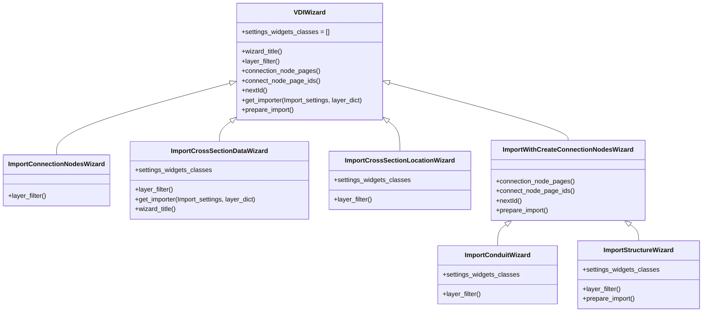
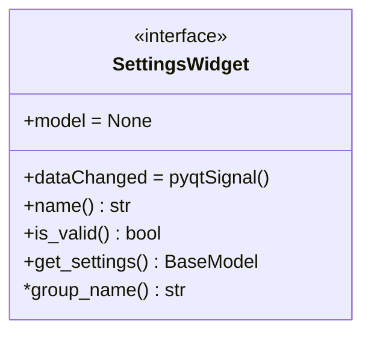

# UI design

## Wizard

The wizard collects a set of pages and guides the user through them in a given order. The wizard has these pages:
* Start page: takes care of layer selection and loading settings from file. This page is the same for all importers
* Settings pages: takes care of import settings. The settings page displays a collection of `SettingsWizard`s defined in `settings_widgets_classes`
* Field map page: takes care of mapping the imported field to the target field
* Connection node page (optional): takes care of setting values for newly created connection nodes and this page is only displayed when needed
* Run page: takes care of running the import and saving the import settings to file

Wizards are created for different kinds of importers, all based on `VDIWizard` which handles most of the work such as building the UI, loading and saving config files and running the actual import. Subclasses are used to use importer specific settings and modifications: 

## Loading data and validation

Import settings are loaded in a `ImportSettings` pydantic model which holds several pydantic models. Note that `ImportSettings` is a generic model which does not include row specific validation for the field map rows. This validation is handled by the `FieldMapModel`. Therefore, for full validation and deserialization the model is converted to a dict and passed down to the pages and widgets. 

## Settings page and widgets

The settings page is initialized with a list of settings widget classes, all derived from `SettingsWidget`:

. Upon initialization of the widgets are instantiated and put in a group box using the `group_name`.  Then the settings page holds a list of settings widgets which are all based on `SettingsWidget` 

## Field map page and widgets

The field map page is used to map values from the imported layer to existing layers per feature. This page is used both for the target layer and, if requested, the connection nodes. The only widget shown on the field map page is the `FieldMapWidget` which shows a table widget using the `FieldMapModel` and `FieldMapDelegate`. Each row in the table represents a mapping of an imported value to the target layer (or connection node layer) and allows the user to choose a mapping method and associated values. For each row we use a `FieldMapRow` that combines the label with a `FieldMapConfig` pydantic model that is used to store and validate the model. Using the `FieldMapRow` we can identify if certain cells in a row are valid and the delegate will highlight invalid rows. Furthermore, the full table can be validated, serialized and deserialized.

The `FieldMapConfig` and row label are created on the fly based on the target model, which is a data model from `data_models.py`. In this way the settings model can be customized. E.g. attributes of data models that are optional will have option to be ignored. Furthermore, display names are derived from the data model as well. [Go here for more information about `FieldMapConfig`](../DESIGN.md#import-configuration-models-and-validation)

Note that the `FieldMapWidget` is also used in two settings widgets where specific settings are, or can be, derived from data. In those cases no data model is used but instead the `FieldMapConfig` is defined in the settings model.

