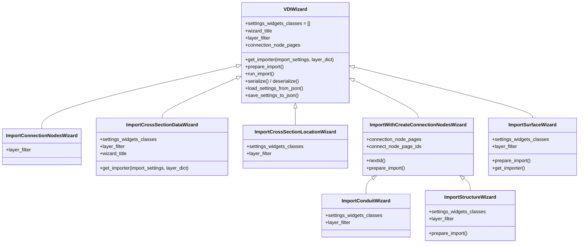
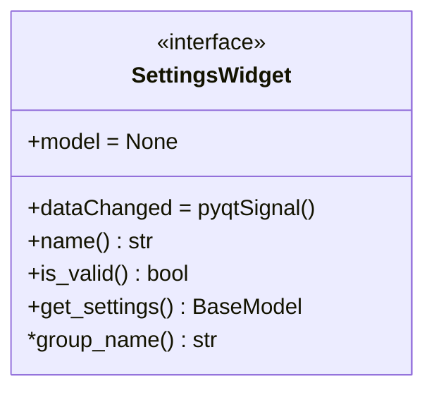

# UI design

## Wizard

The wizard collects a set of pages and guides the user through them in a given order. The wizard has these pages:
* Start page: takes care of layer selection and loading settings from file. This page is the same for all importers.
* Settings page (optional): takes care of import settings. Only shown when the wizard defines `settings_widgets_classes`. Displays a collection of `SettingsWidget`s.
* Field map page: takes care of mapping the imported fields to the target fields.
* Connection node field map page (optional): takes care of setting values for newly created connection nodes. Only shown for structure/conduit imports when `create_nodes` is enabled.
* Run page: takes care of running the import, displaying progress/warnings, and saving the import settings to file.

The actual page flow varies per wizard type:

| Wizard | Pages |
|--------|-------|
| `ImportConnectionNodesWizard` | Start -> Field Map -> Run |
| `ImportCrossSectionDataWizard` | Start -> Settings -> Field Map -> Run |
| `ImportCrossSectionLocationWizard` | Start -> Settings -> Field Map -> Run |
| `ImportConduitWizard` | Start -> Settings -> Field Map -> [CN Field Map] -> Run |
| `ImportStructureWizard` | Start -> Settings -> Field Map -> [CN Field Map] -> Run |
| `ImportSurfaceWizard` | Start -> Settings -> Field Map -> Run |

Wizards are created for different kinds of importers, all based on `VDIWizard` which handles most of the work such as building the UI, loading and saving config files and running the actual import. Subclasses provide importer-specific settings and modifications: 

```mermaid
classDiagram
    VDIWizard <|-- ImportConnectionNodesWizard
    VDIWizard <|-- ImportCrossSectionDataWizard
    VDIWizard <|-- ImportCrossSectionLocationWizard
    VDIWizard <|-- ImportWithCreateConnectionNodesWizard
    ImportWithCreateConnectionNodesWizard <|-- ImportConduitWizard
    ImportWithCreateConnectionNodesWizard <|-- ImportStructureWizard
    VDIWizard <|-- ImportSurfaceWizard
    
    class VDIWizard {
        +settings_widgets_classes = []
        +wizard_title
        +layer_filter
        +connection_node_pages
        +get_importer(import_settings, layer_dict)
        +prepare_import()
        +run_import()
        +serialize() / deserialize()
        +load_settings_from_json()
        +save_settings_to_json()
    }
    
    class ImportConnectionNodesWizard {
        +layer_filter
    }    

    class ImportCrossSectionDataWizard {
        +settings_widgets_classes
        +layer_filter
        +get_importer(import_settings, layer_dict)
        +wizard_title
    }

    class ImportCrossSectionLocationWizard {
        +settings_widgets_classes
        +layer_filter
    }
    
    class ImportWithCreateConnectionNodesWizard {
        +connection_node_pages
        +connect_node_page_ids
        +nextId()
        +prepare_import()
        }

    class ImportConduitWizard { 
        +settings_widgets_classes
        +layer_filter
    }

    class ImportStructureWizard { 
        +settings_widgets_classes
        +layer_filter
        +prepare_import()
    }

    class ImportSurfaceWizard {
        +settings_widgets_classes
        +layer_filter
        +prepare_import()
        +get_importer()
    }

```

## Config loading and saving

Import settings can be saved to and loaded from JSON files. This allows users to reuse import configurations.

- **Load** (Start page): reads JSON, validates via `ImportSettings` pydantic model, then calls `deserialize()` which distributes the settings dict to each page.
- **Save** (Run page): calls `get_settings()` to collect settings from all pages into an `ImportSettings` model, serializes to JSON.
- The last-used config directory is remembered via `QSettings`.

## Settings page and widgets

The settings page is initialized with a list of settings widget classes, all derived from `SettingsWidget`:

```mermaid
classDiagram
class SettingsWidget{
    <<interface>>
    +dataChanged = pyqtSignal()
    +model = None
    +name() str
    +is_valid() bool
    +get_settings() BaseModel
    *group_name() str
}
```

Upon initialization the widgets are instantiated and put in a group box using the `group_name`. The settings page holds a list of settings widgets which are all based on `SettingsWidget`.

Surface settings widget

The wizard provides a `SurfaceSettingsWidget` implementation used by `ImportSurfaceWizard`. `SurfaceSettingsWidget` manages the surface-specific configuration visible on the Settings page: the surface filter and field mappings, sewerage type mappings, and a spatial linking section.

The spatial linking section exposes three QgsMapLayerComboBox widgets (surface map layer, pipe layer, node layer) and a `selected_pipes_only` checkbox. The widget keeps its `SurfaceLinkingSettings` model in sync with the UI: changes to any combo or the checkbox immediately write the corresponding layer name or flag into the nested `linking` model. When deserializing the settings, the widget restores the combo selections via `setCurrentText(name)` and the checkbox state from `selected_pipes_only`.

All of these surface settings are included in the `SurfaceSettings` model returned by `get_settings()` and persisted in the import JSON.

## Field map page and widgets

The field map page is used to map values from the imported layer to existing layers per feature. This page is used both for the target layer and, if requested, the connection nodes. The only widget shown on the field map page is the `FieldMapWidget` which shows a table widget using the `FieldMapModel` and `FieldMapDelegate`. Each row in the table represents a mapping of an imported value to the target layer (or connection node layer) and allows the user to choose a mapping method and associated values. For each row we use a `FieldMapRow` that combines the label with a `FieldMapConfig` pydantic model that is used to store and validate the model. Using the `FieldMapRow` we can identify if certain cells in a row are valid and the delegate will highlight invalid rows. Furthermore, the full table can be validated, serialized and deserialized.

The table has these columns: METHOD, SOURCE_ATTRIBUTE, VALUE_MAP, EXPRESSION, and DEFAULT_VALUE. The visibility of cells depends on the selected method (e.g. SOURCE_ATTRIBUTE is only relevant for the "source attribute" method).

The `FieldMapConfig` and row label are created on the fly based on the target model, which is a data model from `data_models.py`. In this way the settings model can be customized. E.g. attributes of data models that are optional will have the option to be ignored. Furthermore, display names are derived from the data model as well. [Go here for more information about `FieldMapConfig`](../DESIGN.md#import-configuration-models-and-validation)

Note that the `FieldMapWidget` is also used in two settings widgets (via the `FieldMapSettingsWidget` base class) where specific settings are, or can be, derived from data. In those cases no data model is used but instead the `FieldMapConfig` is defined in the settings model.

## Value map dialog

The `ValueMapDialog` allows users to define per-field source-to-target value remappings. It is opened from the VALUE_MAP column in the field map table and presents a two-column table where users map source attribute values to target values. It can auto-populate with unique values from the source layer field.

## Import execution

See the [threading model section](../DESIGN.md#threading-model) in the parent DESIGN.md for details on how the import is executed on a worker thread with progress reporting and cancellation support.
