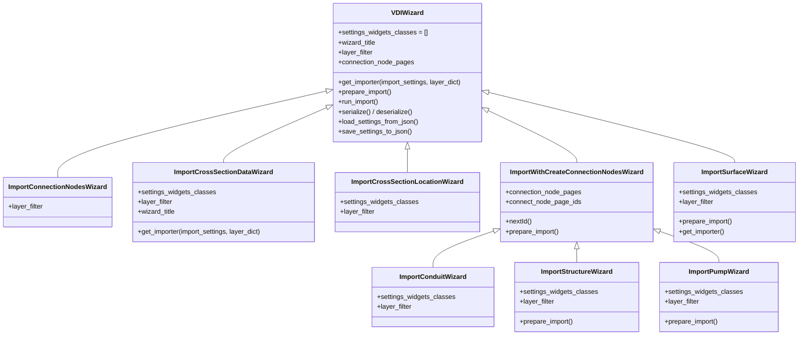
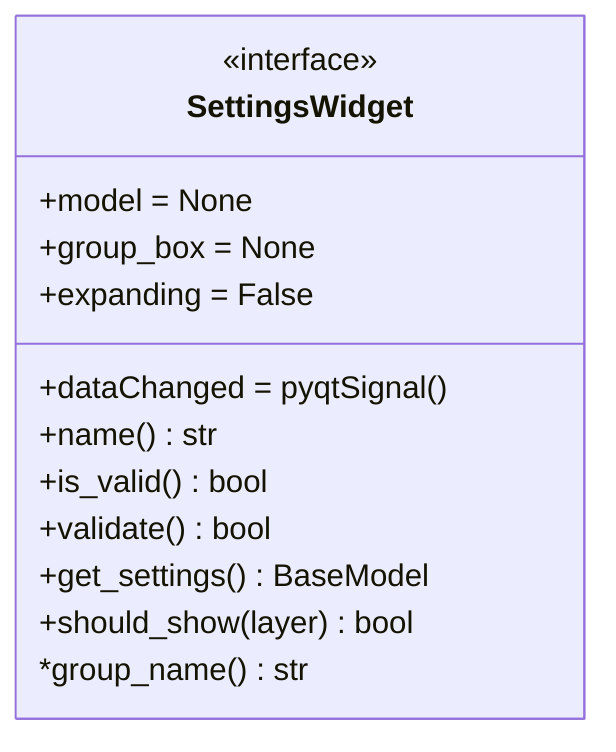

# UI design

## Wizard

The wizard collects a set of pages and guides the user through them in a given order. The wizard has these pages:
* Start page: takes care of layer selection, source filter configuration, and loading settings from file. This page is the same for all importers.
* Settings page (optional): takes care of import settings. Only shown when the wizard defines `settings_widgets_classes`. Displays a collection of `SettingsWidget`s.
* Field map page: takes care of mapping the imported fields to the target fields.
* Connection node field map page (optional): takes care of setting values for newly created connection nodes. Only shown for structure/conduit imports when `create_nodes` is enabled.
* Run page: takes care of running the import, displaying progress/warnings, and saving the import settings to file.

The actual page flow varies per wizard type:

| Wizard | Pages |
|--------|-------|
| `ImportConnectionNodesWizard` | Start -> Field Map -> Run |
| `ImportCrossSectionDataWizard` | Start -> Settings -> Field Map -> Run |
| `ImportCrossSectionLocationWizard` | Start -> Settings -> Field Map -> Run |
| `ImportConduitWizard` | Start -> Settings -> Field Map -> [CN Field Map] -> Run |
| `ImportStructureWizard` | Start -> Settings -> Field Map -> [CN Field Map] -> Run |
| `ImportPumpWizard` | Start -> Settings -> Field Map -> [CN Field Map] -> Run |
| `ImportSurfaceWizard` | Start -> Settings -> Field Map -> Run |

Wizards are created for different kinds of importers, all based on `VDIWizard` which handles most of the work such as building the UI, loading and saving config files and running the actual import. Subclasses provide importer-specific settings and modifications: 


```mermaid
classDiagram
    VDIWizard <|-- ImportConnectionNodesWizard
    VDIWizard <|-- ImportCrossSectionDataWizard
    VDIWizard <|-- ImportCrossSectionLocationWizard
    VDIWizard <|-- ImportWithCreateConnectionNodesWizard
    ImportWithCreateConnectionNodesWizard <|-- ImportConduitWizard
    ImportWithCreateConnectionNodesWizard <|-- ImportStructureWizard
    ImportWithCreateConnectionNodesWizard <|-- ImportPumpWizard
    VDIWizard <|-- ImportSurfaceWizard
    
    class VDIWizard {
        +settings_widgets_classes = []
        +wizard_title
        +layer_filter
        +connection_node_pages
        +get_importer(import_settings, layer_dict)
        +prepare_import()
        +run_import()
        +serialize() / deserialize()
        +load_settings_from_json()
        +save_settings_to_json()
    }
    
    class ImportConnectionNodesWizard {
        +layer_filter
    }    

    class ImportCrossSectionDataWizard {
        +settings_widgets_classes
        +layer_filter
        +get_importer(import_settings, layer_dict)
        +wizard_title
    }

    class ImportCrossSectionLocationWizard {
        +settings_widgets_classes
        +layer_filter
    }
    
    class ImportWithCreateConnectionNodesWizard {
        +connection_node_pages
        +connect_node_page_ids
        +nextId()
        +prepare_import()
        }

    class ImportConduitWizard { 
        +settings_widgets_classes
        +layer_filter
    }

    class ImportStructureWizard { 
        +settings_widgets_classes
        +layer_filter
        +prepare_import()
    }

    class ImportPumpWizard {
        +settings_widgets_classes
        +layer_filter
        +prepare_import()
    }

    class ImportSurfaceWizard {
        +settings_widgets_classes
        +layer_filter
        +prepare_import()
        +get_importer()
    }

```


## Start page

The Start page is shared by all wizard types. It contains:

- A `QgsMapLayerComboBox` for selecting the source layer (filtered by geometry type via `layer_filter`).
- A **Selected features only** checkbox — when checked, only the layer's currently selected features are imported.
- A `QgsFieldExpressionWidget` for an optional filter expression. The expression is evaluated against each candidate feature; only features where it evaluates to `True` are imported. The widget is disabled when no layer is selected and its field list updates when the layer changes. If the expression references fields not present in the newly selected layer it is automatically cleared.
 - A `QgsFieldExpressionWidget` for an optional filter expression. The expression is evaluated against each candidate feature; only features where it evaluates to `True` are imported. The widget is disabled when no layer is selected and its field list updates when the layer changes. If the expression references fields not present in the newly selected layer it is automatically cleared.
 - A **Load import configuration from template** button — opens a file dialog to load a previously saved JSON configuration file. This is equivalent to the load action described in the [Config loading and saving](#config-loading-and-saving) section.

The Start page participates in the wizard's serialize/deserialize flow via `SourceSettings` (name=`"source"`):
- `selected_layer_name` — restored by looking up the layer by name within the combo's filtered list and calling `setLayer()`, which triggers the `layerChanged` signal.
- `use_selected_features` — restored to the checkbox.
- `filter_expression` — restored to the expression widget (and validated against the selected layer).

The four combinations of selected-only and expression are evaluated in `run_import()` before the importer is created, producing a final `selected_ids` list (or `None` for all features) that is passed to `import_features()`.


## Config loading and saving

Import settings can be saved to and loaded from JSON files. This allows users to reuse import configurations.

- **Load** (Start page): reads JSON, validates via `ImportSettings` pydantic model, then calls `deserialize()` which distributes the settings dict to each page — including the Start page for `SourceSettings`.
- **Save** (Run page): calls `get_settings()` to collect settings from all pages (Start, Settings, Field Map) into an `ImportSettings` model, serializes to JSON.
- The last-used config directory is remembered via `QSettings`.


## Settings page and widgets

The settings page is initialized with a list of settings widget classes, all derived from `SettingsWidget`:


```mermaid
classDiagram
class SettingsWidget{
    <<interface>>
    +dataChanged = pyqtSignal()
    +model = None
    +group_box = None
    +expanding = False
    +name() str
    +is_valid() bool
    +validate() bool
    +get_settings() BaseModel
    +should_show(layer) bool
    *group_name() str
}
```

Upon initialization the widgets are instantiated and put in a group box using the `group_name`. The reference to that group box is stored on the widget as `group_box`. The settings page holds a list of settings widgets which are all based on `SettingsWidget`. If a widget sets `expanding = True`, the settings page gives it vertical stretch so it grows to fill available space (used for table-based widgets).

Widgets can be conditionally hidden by overriding `should_show(layer)` — called in `SettingsPage.initializePage()` to toggle the group box visibility based on the selected source layer. The default implementation returns `True` (always shown). Hidden widgets are skipped in `isComplete()` and `get_settings()`.

Some widgets also implement `update_layer(layer)`, called in `initializePage()` to refresh layer-dependent UI state (e.g. populating attribute dropdowns, or hiding sub-fields irrelevant for the selected geometry type).


The following `SettingsWidget` subclasses exist:

- `ConnectionNodeSettingsWidget` — snap distance and create-nodes option.
- `IntegrationSettingsWidget` — integration mode (NONE/CHANNELS/PIPES), snap distance, minimum conduit length. Implements `update_layer(layer)` to hide the minimum conduit length field for point sources (where `PointStructurePlacement` always produces length 0).
- `PointToLineConversionSettingsWidget` — length and azimuth field mappings for point-to-line conversion.
- `PumpDirectionSettingsWidget` — pump direction field mapping. Overrides `should_show(layer)` to return `True` only for line geometry sources, since direction is only used by `PumpLineProcessor`.
- `CrossSectionDataRemapSettingsWidget` — lowest point normalization options.
- `CrossSectionLocationMappingSettingsWidget` — join field configuration for cross-section linking.
- `SurfaceLinkingSettingsWidget` — sewerage type mappings, search distance, `spatial_match_enabled` (toggle spatial nearest-pipe linking), `attribute_match_enabled` (toggle attribute-based linking), and selected-pipes-only flag. Used by `ImportSurfaceWizard`.

## Serialization and deserialization

The wizard serializes its full state to a flat dict keyed by the `name` of each pydantic model, then wraps it in `ImportSettings`. Deserialization distributes the flat dict back to each page.

**Serialization (`get_settings()`):**

`VDIWizard.get_settings()` iterates all pages and calls `page.get_settings()` on every `StartPage`, `SettingsPage`, and `FieldMapPage`. Each returns a dict of `{model.name: model_instance}`. These are merged and passed to `ImportSettings(**data)`.

| Page | Contributes |
|------|-------------|
| `StartPage` | `{"source": SourceSettings(...)}` |
| `SettingsPage` | `{widget.name: widget.get_settings()}` for each widget |
| `FieldMapPage` (fields) | `{"fields": {...}}` |
| `FieldMapPage` (cn fields) | `{"connection_node_fields": {...}}` — skipped if `create_nodes` is False |

**Deserialization (`deserialize(data)`):**

`VDIWizard.deserialize(data)` passes the full flat dict to every page that has a `deserialize` method. Each page extracts its own key:

- `StartPage.deserialize(data)` reads `data["source"]` and restores the layer, checkbox, and expression.
- `SettingsPage.deserialize(data)` builds a `{widget.model.name: widget}` map and calls `widget.deserialize(data[name])` for each matching key.
- `FieldMapPage.deserialize(data)` reads `data[self.name]` (either `"fields"` or `"connection_node_fields"`).

**Outliers:**

- `ImportWithCreateConnectionNodesWizard` conditionally skips the connection node field map page in both `get_settings()` and page navigation (`nextId()`) based on whether `create_nodes` is enabled in `ConnectionNodeSettingsWidget`.
- `ImportCrossSectionDataWizard` overrides `get_importer()` and passes all target layers directly rather than via a `layer_dict` from `prepare_import()`.


## Field map page and widgets

The field map page is used to map values from the imported layer to existing layers per feature. This page is used both for the target layer and, if requested, the connection nodes. The only widget shown on the field map page is the `FieldMapWidget` which shows a table widget using the `FieldMapModel` and `FieldMapDelegate`. Each row in the table represents a mapping of an imported value to the target layer (or connection node layer) and allows the user to choose a mapping method and associated values. For each row we use a `FieldMapRow` that combines the label with a `FieldMapConfig` pydantic model that is used to store and validate the model. Using the `FieldMapRow` we can identify if certain cells in a row are valid and the delegate will highlight invalid rows. Furthermore, the full table can be validated, serialized and deserialized.

The table has these columns: METHOD, SOURCE_ATTRIBUTE, VALUE_MAP, EXPRESSION, and DEFAULT_VALUE. The visibility of cells depends on the selected method (e.g. SOURCE_ATTRIBUTE is only relevant for the "source attribute" method).

The `FieldMapConfig` and row label are created on the fly based on the target model, which is a data model from `data_models.py`. In this way the settings model can be customized. E.g. attributes of data models that are optional will have the option to be ignored. Furthermore, display names are derived from the data model as well. [Go here for more information about `FieldMapConfig`](../DESIGN.md#import-configuration-models-and-validation)

Note that the `FieldMapWidget` is also used in two settings widgets (via the `FieldMapSettingsWidget` base class) where specific settings are, or can be, derived from data. In those cases no data model is used but instead the `FieldMapConfig` is defined in the settings model.


## Value map dialog

The `ValueMapDialog` allows users to define per-field source-to-target value remappings. It is opened from the VALUE_MAP column in the field map table and presents a two-column table where users map source attribute values to target values. It can auto-populate with unique values from the source layer field.


## Import execution

See the [threading model section](../DESIGN.md#threading-model) in the parent DESIGN.md for details on how the import is executed on a worker thread with progress reporting and cancellation support.


## Draft persistence

In addition to explicit save/load via JSON config files, the wizard automatically persists its current settings as a draft. Drafts are saved to:

```
~/.qgis/vdi_preset_drafts/{WizardClassName}.json
```

The draft is updated whenever the user navigates through the wizard. When the wizard is shown (`showEvent()`), if a draft exists from a previous session, the user is prompted to restore it. Restoring a draft calls `deserialize()` just like loading from a config file.

Drafts are a convenience feature to avoid losing partially-configured imports on accidental close; they are distinct from the explicit "Save as..." / "Load..." configuration file workflow on the Start page and Run page.
